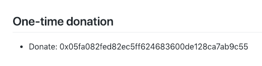
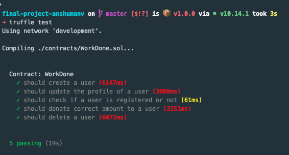
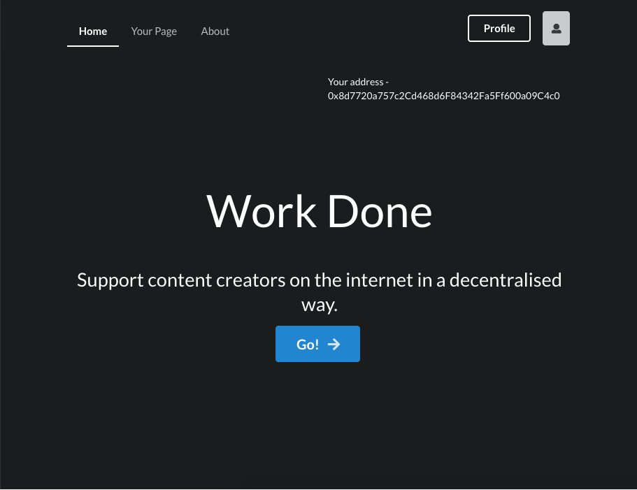
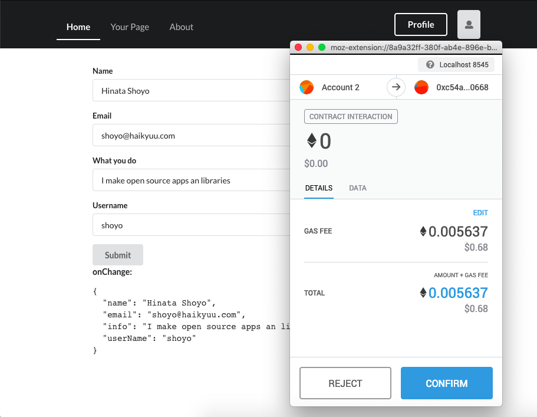
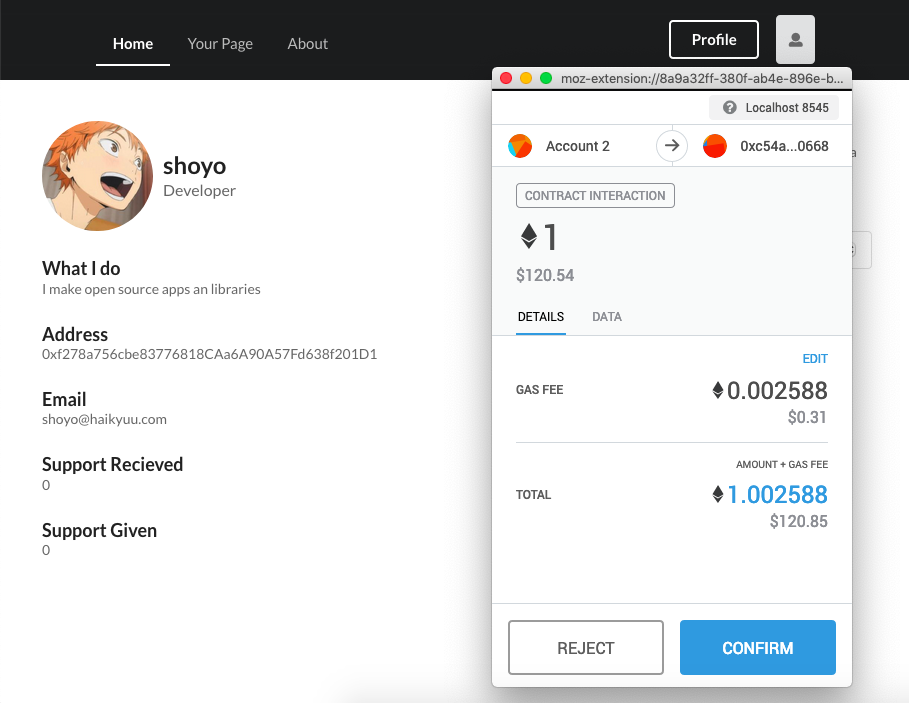

<p align="center">
  
</p>

<h1 align="center"> Work Done </h1>
<p align="center">

</p>

<p align="center">A Decentralized app to support content creators.</p>


### Abstract
Work Done is meant to be a decentralized platform for people to donate or support content creators..

The concept is similar to how personalised donation pages work, the difference is that the users can support these creators in the form of cryptocurrency directly using their metamask wallets. Creators can just register their address using their metamask wallet, fill the basic information about them, what they do etc and then share the link to their profile with people who wish to support them.

#### The Problem



I've seen content creators post their wallet addresses like this and then people who wish to support them have to copy this address, open wallet, enter amount to donate etc. So why not have a personalised page for the content creators containing their address so users who wish to support them just visit the creators page and donate the amount they want to directly.

### Benefits
- Get statistics based on the donation recieved, top donors, donations given etc.
- Showcase all your work in one place so users can see and support accordingly.
- Share a shortened link to your page for donations/support rather than copying address here and there.
- A more user friendly way to support in cryptocurrency. 


#### External Contracts Used
- OpenZeppelin SafeMath  
- OpenZeppelin Ownable


## Development

#### Prerequisites

This is my setup while developing this.
- OS: macOS Mojave 10.14.2 18C54 x86_64
- Node.js: 10.14.1
- npm: 6.4.1
- truffle: v5.0.0
- Ganache CLI: v6.2.3

#### Setup local development instance

* Clone the project locally
```
git clone https://github.com/dev-bootcamp-2019/final-project-anshumanv
cd final-project-anshumanv
```

* Start local development blockchain and copy the mnemonic to be used later
```
ganache-cli -b 3
```

* Compile contracts and migrate them to the blockchain
```
npm i
truffle compile
truffle migrate
```

##### Setup the frontend
The frontend is a React app that uses drizzle to interact with the contract.

```
cd client
npm i
npm start
```

### Run Tests
```
truffle test
```




### Initial setup

- Goto [localhost:3000](http://localhost:3000) and login into metamask using the mnemonic obtained from ganache.
- Allow connecting the app to web3
- Owner's account will be already created and will be the one who initiated the contract.
- You can then switch to a different metamask account and register/donate etc.

### Future work
- Creators can feature their top supporters
- Badges for interesting statistics about donation given or recieved.
- Donation Leaderboards
- A more friendly page link
- Integrate drizzle-react
- Improve UI/UX

### Screenshots

Landing


Register


Donate


<div>Icons made by <a href="https://www.freepik.com/" title="Freepik">Freepik</a> from <a href="https://www.flaticon.com/" 			    title="Flaticon">www.flaticon.com</a> is licensed by <a href="http://creativecommons.org/licenses/by/3.0/" 			    title="Creative Commons BY 3.0" target="_blank">CC 3.0 BY</a></div>


## Author

[Anshuman Verma](https://github.com/anshumanv)

[](https://twitter.com/Anshumaniac12)
[](https://linkedin.com/in/anshumanv12)
[](https://www.facebook.com/anshumanv12)

